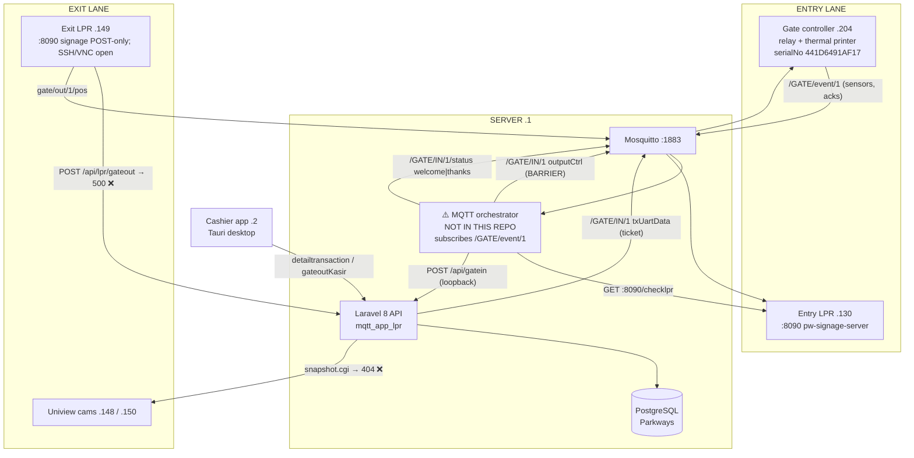

# Trafix — LPR Parking System

> **Purpose of this document.** This is a handoff brief for an AI agent or engineer picking up this
> codebase cold. Most of it was reconstructed by analysing a 1 GB Wireshark capture
> (`cap2.pcapng`) of the live site, then cross-checking against source. It documents how the system
> *actually behaves in production*, which in several places differs from what the code suggests.
>
> **Evidence markers used throughout — please respect these:**
>
> | Marker | Meaning |
> |---|---|
> | ✅ **VERIFIED** | Observed directly in packets *and/or* read in source. Trust it. |
> | 🔶 **INFERRED** | Reasoned from evidence but not directly observed. Re-check before relying on it. |
> | ❓ **UNKNOWN** | Genuinely not determined. Do not guess — investigate. |
>
> Do not upgrade an INFERRED or UNKNOWN item to fact without new evidence.

---

## 1. What this system is

An ANPR/LPR (licence-plate recognition) parking management system for a single site:

**Sinode GKJ, Jl. Dr. Sumardi No. 8, Kec. Sidorejo, Kota Salatiga, Jawa Tengah, Indonesia**
(✅ read from the ESC/POS ticket bytes on the wire)

Vehicles (mostly motorcycles) enter, a thermal ticket with a QR code is printed, the barrier opens.
On exit a cashier settles the fee and lets them out. Members and casual parkers are handled
differently. Branding assets in the frontend bundle say `fix-parking` / `bssparking`.

---

## 2. Repository layout

| Path | What it is | State |
|---|---|---|
| `mqtt_app_lpr/` | **The main application.** Laravel 8 REST API + business logic + DB + ESC/POS ticket building. This is where you will do most work. | Source available |
| `mqtt_fe_lpr/output/` | Frontend, but **build output only** (Nitro + TanStack). `nitro.json`, minified `assets/*.js`. | ⚠️ No source |
| `mqtt_listener_app/` | Small Node service. Subscribes to a **Pusher** channel `payment_kasir` (`listener.js:57`). Unrelated to gate control. | Source available |
| `Monitoring/` | `monitoring_mqtt` — a compiled ELF x86-64 binary (24 KB, not stripped) plus `lib/`, `data/`. | ⚠️ Binary only |
| `mosquitto/` | MQTT broker config/data. **Permissions `d---------` (mode 000) — unreadable.** | ⚠️ Inaccessible |
| `cap.pcapng`, `cap2.pcapng` | Wireshark captures (4 MB and 1 GB). Source of most of this document. | Data |

**Stack** (`mqtt_app_lpr/composer.json`): PHP 7.3/8.x, Laravel 8.65, `php-mqtt/client` 2.3,
`charlieuki/receiptprinter` (ESC/POS), Sanctum, Guzzle, Intervention Image, Telegram SDK, Twilio,
Google API client, Maatwebsite Excel, Spatie Backup.

### Deployment & configuration (✅ from `mqtt_app_lpr/.env`, secrets redacted)

Dockerised — `Dockerfile` in `mqtt_app_lpr/` and `mqtt_listener_app/`; hostnames are compose
service names, so expect a compose file that is **not in this tree**.

| Setting | Value | Note |
|---|---|---|
| `DB_CONNECTION` | `pgsql` @ `postgres_container:5432`, db `Parkways` | **PostgreSQL, not MySQL** |
| `MQTT_HOST` / `PORT` | `mosquitto:1883` | Auth required: user `bssparking` |
| `MQTT_CLIENT_ID` | `payment-subscriber-v3` | Overrides the `…-v2` default in `config/mqtt.php` |
| `QUEUE_CONNECTION` | `database` | ⚠️ see below |
| `CACHE_DRIVER` | `file` | Used for the `qr_refill_lock_*` mutex |
| `BROADCAST_DRIVER` | `log` | Pusher credentials are blank |
| `APP_ENV` | `local` | ⚠️ on what is evidently a production site |

⚠️ **A queue worker is mandatory.** Image handling is entirely asynchronous —
`DownloadLprGateinJob`, `DownloadLprImageJob`, `CaptureRtspImageJob`, and `GenerateQrPoolJob` are
all `dispatch()`ed to the `database` queue. With no `queue:work` running, tickets still print and
barriers still open, but **photos silently never download and the Xendit QR pool never refills**.
🔶 Worth checking early if images appear missing — the failure looks like a code bug but isn't.

### ⚠️ Critical: a core component is NOT in this repo

Something on the server subscribes to `/GATE/event/1`, reacts to sensor input, and publishes the
**barrier-open command**. It is not here. Verified absent:

```
grep -rl "outputCtrl" .   → no matches (excluding vendor/, node_modules/)
grep -rl "welcome"        → no matches in mqtt_app_lpr/app
grep -rl "GATE/event"     → no matches
grep -rl "checklpr"       → no matches
```

Laravel publishes **only** `txUartData` (ticket print) to `/GATE/IN/{gate}`. Every other MQTT
message seen on the wire from the server — `outputCtrl` (relay/barrier), and
`/GATE/IN/1/status` `welcome`/`thanks` — comes from this missing orchestrator.
🔶 **INFERRED:** it lives in the unreadable `mosquitto/` directory or is deployed outside this tree.
**Find it before changing gate behaviour.**

---

## 3. Network topology

All ✅ VERIFIED from the capture (`enp2s0`, 2026‑07‑24 03:51:19–04:34:48 WIB, ~43.5 min,
1,100,623 packets).

| IP | Role | Notes |
|---|---|---|
| `192.168.1.1` | **Server** | nginx + Laravel (PHP 8.2.32), Mosquitto on `:1883`, image store `/storage/` |
| `192.168.1.2` | **Cashier desktop app** | Tauri (`Origin: tauri://localhost`), drives gate-out |
| `192.168.1.3` | LAN router/gateway | `_gateway`, MAC `DC:4E:F4` (Shenzhen MTN Electronics). The network gateway, absent from the original capture notes |
| `192.168.1.130` | **Entry LPR unit** | Serves `:8090` (`pw-signage-server`). Healthy — accepted 6 connections |
| `192.168.1.149` | **Exit LPR unit** | Linux box: SSH `:22` (OpenSSH 7.6p1), Boa HTTPd `:80`, VNC `:5900`, `pw-signage-gateout-server` on `:8090` (POST-only). Publishes MQTT. See §7.2 |
| `192.168.1.148` | Uniview IP camera | Streams on `:9998`/`:9999` (~570 MB/capture), config CGI on `:8000` |
| `192.168.1.150` | Uniview IP camera | Same pattern (~400 MB/capture) |
| `192.168.1.168` | **Network receipt printer** | Referenced as `connector_descriptor` in `config/receiptprinter.php:22` (ESC/POS over TCP). ❓ Offline during the 2026-08-03 nmap sweep |
| `192.168.1.204` | **Gate controller** | Relay + printer board, `serialNo 441D6491AF17`. Entry barrier + thermal printer |
| `192.168.1.182` | Unidentified device | Has a permanently dead MQTT session (see §7.4) ❓ role unknown |
| `192.168.1.4` / `.9` / `.33` | Uniview IP cameras | OUI `C4:79:05`; additional Uniview units beyond `.148`/`.150`, roles ❓ unconfirmed |
| `192.168.1.6` / `.7` / `.8` / `.34` / `.36` | IP cameras | OUI `88:26:3F`; HTTP `:80` + RTSP `:554`, vendor ❓ unconfirmed |

**External:** `remote.bct.co.id` (`103.164.21.20`) receives heartbeat/sysinfo — **currently
100 % failing**, see §7.3. The LPR units and `.182` ping Tencent Cloud
(`139.199.208.254`, `111.230.244.61`) every ~1.6 s — 4,844 echo requests in 43 min. 🔶 vendor
phone-home; harmless but it is continuous outbound traffic to China.

### 🔑 Why the capture looks incomplete

The capture is of `enp2s0`. **Loopback traffic on `.1` is invisible.** The orchestrator calls the
Laravel API over `127.0.0.1`, so `POST /api/gatein` never appears on the wire even though it
definitely runs. Proof: `GateController::gatein()` has `usleep(200000)` between its two MQTT
publishes, and the capture shows the two `txUartData` messages exactly 200 ms apart
(43.29 s → 43.49 s). ✅ VERIFIED — **do not conclude an endpoint is unused just because it is
absent from the capture.**

---

## 4. Architecture



---

## 5. Check-in flow — ✅ WORKS

Reconstructed from one complete cycle at t = 39–50 s (ticket `9922432407`). Entry is **MQTT-driven**,
not triggered by an inbound HTTP call.

| # | Actor | Event |
|---|---|---|
| 1 | `.204` → broker | `/GATE/event/1` `{method:"inputInfo", data:{input3:1}}` — arrival loop |
| 2 | server → `.130` | `/GATE/IN/1/status` `{"status":"welcome"}` |
| 3 | `.204` → broker | `inputInfo input2=1` (input3 still 1) — driver presses ticket button |
| 4 | server → `.130` | `GET :8090/checklpr` → `{"plate_num":"H488AI","url_gambar":"http://192.168.1.130:8090/image/H488AI.jpg"}` |
| 5 | server → `.204` | `/GATE/IN/1` `txUartData` #1 — ESC/POS site header |
| 6 | `.204` → server | `/GATE/event/1` `txUartData {}` — ack (empty data, verified on site 2026-08-04) |
| 7 | server → `.204` | `/GATE/IN/1` `txUartData` #2 — ticket body (QR, plate, time, tariffs) — **200 ms after #1** |
| 8 | server → `.130` | `/GATE/IN/1/status` `{"status":"thanks"}` |
| 9 | server → `.204` | `/GATE/IN/1` `outputCtrl {beepOut:[1,100], relay1Out:[1,1000]}` — **🚧 BARRIER OPENS** |
| 10 | `.204` → server | `outputCtrl` ack |
| 11 | server → `.130` | `GET :8090/image/H488AI.jpg` → 200 — archive entry photo |
| 12 | `.204` → server | `inputInfo input4=1` — vehicle clears lane |

**Timing:** arrival → barrier ≈ 4.4 s; full cycle ≈ 10 s.

**Sensor map** (🔶 INFERRED from state transitions, not from a datasheet):
`input3` = arrival loop · `input2` = ticket button · `input4` = pass-through loop · `input1` ❓ never
seen active. `relay1` = entry barrier · `relay2`/`relay3` ❓ never actuated.

**Code path:** `GateController::gatein()` (`GateController.php:48`) — generates
`transaction_code` via `generateTrxCode()` (timestamp + 3 random digits, collision-checked),
picks a Xendit QR from `XenditQrPool` if the location is `active` (else `typeqr = 'cash'`),
inserts `transactions` with `status='gatein'`, builds ESC/POS via
`TicketPrinterService::buildGateIn1/2()`, publishes both parts to `/GATE/IN/{gate}` at QoS 1.

**Member auto-entry (observed 2026-08-04):** when a member taps an RFID card, the board
publishes `readCard` instead of a button press:

```
00:36:10  /GATE/event/1  readCard  {"reader":1,"cardLen":10,"cardNo":"006343040"}
```

`cardNo` is a string (the leading zero is significant) and `cardLen` is the reader's fixed
buffer length — 10 — not `len(cardNo)` (9 here). No ack follows. The orchestrator resolves
the card against `Members.card_number`, writes a `type='member'` transaction (no paper
ticket), and opens the barrier. The trailing `inputInfo input2=1` with `input3=0` in the
same log is a separate, unrelated button event.

**Decoded ticket** (✅ actual bytes off the wire):

```
Sinode GKJ                                    ← buildGateIn1: header
Jl. Dr. Sumardi No. 8, Kec.
Sidorejo, Kota Salatiga, Jawa
Tengah
[QR] 9922432407
---
Simpan QR untuk Keluar Parkir                 ← buildGateIn2: body
Plat: H488AI
9922432407-Motor-IN 1
Enter Time: 2026-07-24 03:52:02
--------------------------
Tiket hilang motor Rp10000 mobil Rp30000
Denda inap motor Rp10000 mobil Rp25000
```

---

## 6. Check-out flow — ❌ AUTOMATED PATH DEAD, cashier carries it

Reconstructed at t = 331–358 s.

| # | Actor | Event | Result |
|---|---|---|---|
| 1 | `.149` → server | `POST /api/lpr/gateout` | ❌ **500** — method does not exist (§7.1) |
| 2 | `.149` → broker | `gate/out/1/pos` `{"plate_num":"H4818AI","url_gambar":"http://192.168.1.149:8090/image/H4818AI.jpg"}` | ⚠️ GET on that URL returns 405 (§7.2) |
| 3 | `.2` → server | `POST /api/lpr/checkimagegateout?plate_num=…` | ❌ **404** `Active transaction not found for this plate_num` |
| 4 | `.2` → server | `POST /api/gateout/detailtransaction` (multipart) | ✅ **200** — fee, duration, member status |
| 4a | server → `.148` | `GET /cgi-bin/snapshot.cgi?channel=1&subtype=0` (`CaptureCctv()`) | ❌ **404** — no exit photo (§7.5) |
| 5 | `.2` → server | `GET /storage/….jpg` | ✅ 200 — show entry/exit photos |
| 6 | `.2` → server | `OPTIONS /api/gateout/gateoutKasir` | ✅ 204 — CORS preflight |
| 7 | `.2` → server | `PUT /api/gateout/gateoutKasir` | ✅ **200** `{"status":"already_paid"}` |
| 8 | — | **exit barrier** | ❓ **no command is ever sent** (§7.6) |

So in practice: **the operator scans the ticket QR and the plate-recognition path contributes
nothing.** All 7 observed gate-outs succeeded via step 7. Because the fallback always works, the
automated path's total failure is invisible in day-to-day operation.

`detailtransaction` request body (multipart): `transaction_code`, `vehicle_id`, `ipcam`,
`gate_out`, `admin_id`, `shift_id`, `police_number`.

`gateoutKasir` request body (form-urlencoded): `transaction_code`, `discount_card`,
`total_discount`, `gate_out`, `admin_id`, `shift_id`, `vehicle_id`, `police_number`, `ipcam`.

Response showing the **member** path (✅ real response, name is real site data):

```json
{"status":"success","status_code":200,"transaction":"member","message":"success_member",
 "data":{"member_code":"H4818AI","name":"Angelo","time_limit":"2126-06-14",
   "transaction_code":"8564748066","vehicle_id":"1",
   "time_checkin":"2026-07-24 03:29:24","time_checkout":"2026-07-24 03:51:36",
   "duration":"22 m 12 s","total":0,"cam_in":"-",
   "cam_out":"storage/CAMIN202607240351360000001.jpg",
   "payment_status":"lunas","police_number":"H4818AI"}}
```

---

## 7. Known defects

Ordered by how much they block automated LPR gate-out.

### 7.1 ❌ `POST /api/lpr/gateout` → 500, route points at a non-existent method

**The single hardest blocker.** ✅ VERIFIED in packets *and* source.

`mqtt_app_lpr/routes/api.php:205`:
```php
Route::post('lpr/gateout',[GateoutController::class, 'GateOutLpr']);
```
`GateoutController` has **no** `GateOutLpr` method. Laravel returns:
```
Method App\Http\Controllers\GateoutController::GateOutLpr does not exist. (500 Internal Server Error)
```
5 occurrences in 43 min — one per exit event.

The LPR route set is otherwise symmetric; exactly one of six is missing:

| Route | Method | Exists? |
|---|---|---|
| `POST lpr/gateinimage` | `GateController::GateinImageLpr` | ✅ `GateController.php:387` |
| `POST lpr/gatein` | `GateController::GateInLpr` | ✅ `GateController.php:428` |
| `POST lpr/checkimage` | `GateController::checkLprImage` | ✅ `GateController.php:459` |
| `PUT lpr/gateoutcard` | `GateoutController::GateOutRfidLpr` | ✅ `GateoutController.php:1603` |
| `POST lpr/gateout` | `GateoutController::GateOutLpr` | ❌ **MISSING** |
| `POST lpr/checkimagegateout` | `GateoutController::checkLprImageGateOut` | ✅ `GateoutController.php:1748` |

**Closest template:** `GateOutRfidLpr` (`:1603`) — resolves member (`card_number` + `gate_status='in'`)
vs ticket (`transaction_code`), calls `CalculateRate()`, then sets `time_checkout`,
`payment_status='lunas'`, `gate_status='out'`, `total`, `duration`, `cam_out`/`camout_lpr`.

### 7.2 ⚠️ Exit LPR advertises an image URL nothing can fetch

`.149` publishes `url_gambar: http://192.168.1.149:8090/image/<PLATE>.jpg`. During the whole
43-minute capture `.149` accepted zero TCP connections, which read as "its `:8090` is dead". The
2026-08-03 nmap sweep rewrites that:

| Port | Service (nmap) |
|------|----------------|
| `22` | OpenSSH 7.6p1 (Ubuntu) |
| `80` | Boa HTTPd 0.94.13 |
| `5900` | VNC (protocol 3.8) |
| `8090` | `pw-signage-gateout-server` — answers, but returns `405 Only POST method is allowed` to GET |

So `.149` is a Linux appliance whose signage server is **up today**; the earlier "dead" reading was
capture-period-specific (or a service that has since returned). The advertised image URL is a
**GET** to `/image/<PLATE>.jpg`, which the POST-only server rejects with 405 — so
`checkLprImageGateOut`'s `Http::timeout(5)->get($url_image)` still falls into its
`'Image is not available or unreachable'` branch. **Consequence unchanged, mechanism corrected.**

❓ What POST endpoint does the gateout server accept, and does `GET /image/...` work at all —
determine before wiring the Python exit path to `.149`.

### 7.3 ❌ Remote heartbeat 100 % failing (upstream, not your code)

154 × `POST /api/heartbeat` + 22 × `POST /api/sysinfo` to `remote.bct.co.id`. **Zero** valid
`HTTP/1.` responses. All 177 replies are an identical 58-byte F5 message:

```
BIG-IP: [0x31ae141:4666] {peer} TCP RST from remote system
```

The pool member behind their load balancer is refusing connections. Not fixable locally —
escalate to whoever operates that host. The local agent retries silently and surfaces no error.

### 7.4 ❌ Blackholed MQTT session to an external broker

`192.168.1.182` → `47.84.188.231:1883` (Alibaba Cloud): 472 frames, **all outbound, zero
returned**. 118 `PINGREQ` at ~22 s intervals, every one retransmitted, no `PINGRESP` ever.
No `CONNECT` in the capture, so the session predates it. ❓ What `.182` is and whether this
matters is unknown.

### 7.5 ❌ Exit snapshot capture always 404s

`CaptureCctv()` issues `GET http://192.168.1.148/cgi-bin/snapshot.cgi?channel=1&subtype=0`
→ 404 on all 21 attempts. The camera's own embedded server replies
`<html><head><title>Welcome!</title></head><body>404 NOT FOUND</body></html>`, and ✅ **no
`Authorization` header is ever sent**. `.148`/`.150` are Uniview
(they talk to `en-uniarch.uniview.com`), so 🔶 `snapshot.cgi` is likely the wrong vendor's
CGI path (that spelling is Dahua's) and/or digest auth is required. Result: `cam_out` is never
populated from the camera.

### 7.6 ❓ Nothing commands the exit barrier

✅ VERIFIED: `GateoutController` contains **no MQTT publish at all** — `gate_out` is only ever a
DB column value. No `outputCtrl` appears anywhere in the capture after a successful gate-out; the
only relay command in 43 minutes is entry `relay1`. ❓ How the exit barrier physically opens is
**undetermined** — plausibly an operator button or a local relay on `.149`, but this is a real gap
in the model. Establish this before touching exit logic.

### 7.7 ⚠️ Plate strings do not agree between entry and exit

`checkLprImageGateOut` (`:1748`) matches `police_number` **exactly**, with `whereNull('time_checkout')`:

```php
$transaction = Transactions::where('police_number', strtoupper($plate_num))
    ->whereNull('time_checkout')->orderBy('time_checkin','desc')->first();
```

Observed data:

| Entry ticket (via `.130`) | Exit query (via `.149`) |
|---|---|
| `H488AI` @ 03:52:02 (ticket `9922432407`) | `H4818AI`, later `48184I` |
| `H488AI` @ 03:57:43 (ticket `0263565550`) | `B246NDI` / `B244NDI` |
| **(blank)** × 4 of 6 tickets | `H6411PL` |

Two independent problems: **(a)** the two cameras produce different strings for what may be the
same vehicle, and **(b)** ✅ **4 of 6 entry tickets recorded no plate at all**, which can never
match anything. Note `H4818AI` is *also* a registered member plate (`member_code`, driver
"Angelo"), so ❓ whether `H488AI`/`H4818AI`/`48184I` are one misread vehicle or several distinct
ones **cannot be settled from packets** — query the `transactions` table.

Also ⚠️ inconsistent state modelling: `GateOutRfidLpr` filters on `gate_status='in'` while
`checkLprImageGateOut` filters on `whereNull('time_checkout')`. Confirm which is authoritative
before writing new lookups.

---

## 8. MQTT reference

Broker `192.168.1.1:1883` (`mosquitto` in Docker), no TLS, username `bssparking`. `MqttService`
(`app/Services/MqttService.php`) publishes at **QoS 1** with `clean_session = false` and a **fixed
`client_id`** — `payment-subscriber-v3` per `.env`, overriding the `…-v2` default in
`config/mqtt.php`. ⚠️ A fixed client ID plus a persistent session means two concurrent publishers
sharing it would evict each other; the orchestrator in §2 must be using a different ID. Check this
before adding another publisher.

Observed traffic: 443 frames — 155 `PUBLISH`, 203 `PINGREQ`, 85 `PINGRESP`. **No `CONNECT` or
`SUBSCRIBE`** in the capture; all sessions predate it. Note PINGREQ (203) far exceeds PINGRESP (85)
because `.182`'s dead session (§7.4) contributes 118 unanswered pings.

| Topic | Direction | Count | Payload |
|---|---|---|---|
| `/GATE/event/1` | `.204` → server | 122 | Controller → server: `status`, `inputInfo`, `readCard`, and acks for `txUartData` / `outputCtrl` |
| `/GATE/IN/1` | server → `.204` | 18 | Commands: `txUartData` (print), `outputCtrl` (relay/beep) |
| `/GATE/IN/1/status` | server → `.130` | 10 | `{"status":"welcome"}` / `{"status":"thanks"}` |
| `gate/out/1/pos` | `.149` → server | 5 | `{"plate_num":…,"url_gambar":…}` — ⚠️ note lowercase/different convention from the `/GATE/…` topics |

Envelope used on `/GATE/IN/1` and `/GATE/event/1`:

```json
{"id":"<md5 or int>","serialNo":"441D6491AF17","version":"1.0","taskNo":2,
 "method":"txUartData|outputCtrl|inputInfo|status|readCard","data": {...}}
```

Barrier open (the one that matters):
```json
{"method":"outputCtrl","serialNo":"441D6491AF17","taskNo":1,"version":"1.0",
 "data":{"beepOut":[1,100],"relay1Out":[1,1000]}}
```
🔶 `[state, duration_ms]` — so a 1000 ms relay pulse and a 100 ms beep.

`txUartData` carries **doubly-encoded** payloads: JSON → `data[].uartData` is a hex string →
decodes to raw ESC/POS printer bytes. Decode with:
```python
bytes.fromhex(json.loads(payload)["data"][0]["uartData"])
```

---

## 9. HTTP API — endpoints observed live

448 requests / 118 responses. Codes: **76 × 200, 27 × 404, 7 × 204, 5 × 500, 3 × 101**.

| Endpoint | Method | Observed | Status |
|---|---|---|---|
| `/api/gateout/detailtransaction` | POST | 7 | ✅ 200 — fee/duration/member lookup by ticket |
| `/api/gateout/gateoutKasir` | PUT | 7 | ✅ 200 `already_paid` — **the path that actually works** |
| `/api/gateout/gateoutKasir` | OPTIONS | 7 | ✅ 204 CORS preflight |
| `/api/lpr/checkimagegateout` | POST | 6 | ❌ 404 (§7.7) |
| `/api/lpr/gateout` | POST | 5 | ❌ 500 (§7.1) |
| `/api/gatein` | POST | 0 on wire | ✅ runs over loopback (§3) |
| `.130:8090/checklpr` | GET | 6 | ✅ 200 — entry plate read |
| `.130:8090/image/<PLATE>.jpg` | GET | 2 | ✅ 200 `image/jpeg` |
| `.148/cgi-bin/snapshot.cgi` | GET | 21 | ❌ 404 (§7.5) |
| `/storage/**.jpg` | GET | 9 | ✅ 200 |
| `remote.bct.co.id/api/heartbeat` | POST | 154 | ❌ no HTTP reply (§7.3) |
| `remote.bct.co.id/api/sysinfo` | POST | 22 | ❌ no HTTP reply (§7.3) |

CORS matters here: the cashier app sends `Origin: tauri://localhost`, so preflight handling
(`fruitcake/laravel-cors`) is load-bearing.

Image naming conventions: `CAMIN_LPR_<YmdHisu>.jpg` (LPR entry, `storage/lpr/gatein/`) vs
`CAMIN<timestamp>.jpg` (RTSP/CCTV capture).

---

## 10. Reproducing the analysis

`cap2.pcapng` is 1 GB; a full pass costs ~30 s. Carve subsets first, and beware: **writing a
filtered file can drop frames** whose dissection depends on TCP reassembly — the `PUT`s to
`gateoutKasir` vanished from a `-Y "http" -w` subset and only appeared in the full file. Take
final counts from the original.

```bash
capinfos cap2.pcapng                       # metadata
tshark -r cap2.pcapng -q -z io,phs         # protocol hierarchy

# the two protocols of interest
tshark -r cap2.pcapng -Y "mqtt" -w mqtt.pcapng
tshark -r cap2.pcapng -Y "http" -w http.pcapng

# every failure at a glance
tshark -r cap2.pcapng -Y "http.response.code >= 400" \
  -T fields -e frame.time_relative -e ip.src -e http.response.code

# correlate a response back to its request (http.response_for.uri does NOT exist in tshark 4.2)
tshark -r cap2.pcapng -Y "http.response" -T fields -e http.request_in -e http.response.code

# read a full exchange when dissection is incomplete
tshark -r cap2.pcapng -Y "frame.number==17615" -T fields -e tcp.stream
tshark -r cap2.pcapng -q -z follow,tcp,ascii,36

# is a host actually listening?
tshark -r cap2.pcapng -Y 'ip.src==192.168.1.149 && tcp.flags.syn==1 && tcp.flags.ack==1'
```

Gotchas that cost time:
- `-z conv,tcp` **ignores `-Y`**; pass the filter as `-z conv,tcp,<filter>` instead.
- An invalid `-e` field name makes tshark exit silently if stderr is hidden — don't `2>/dev/null`
  while debugging.
- `tcp.payload` came back empty under reassembly; use `follow,tcp,ascii` instead.
- `tshark -G fields` puts the field name in **column 3**, not column 2.

**Network health** was fine, so don't chase phantom network faults: 1,196 retransmissions across
1.06 M TCP frames (0.11 %), 16 lost segments, 448 duplicate ACKs, 0 zero-window. Of 245 resets,
33 are `.148:9999` video-stream reconnects. Every defect above is application- or
configuration-level.

---

## 11. Open questions to resolve first

1. **Where is the MQTT orchestrator?** (§2) Nothing that opens a barrier is in this repo. Highest
   priority — you cannot safely change gate behaviour without it. `mosquitto/` is mode 000.
2. **How does the exit barrier open?** (§7.6) No command exists in code or capture.
3. **What does `.149:8090`'s POST API accept, and does `GET /image/` work?** (§7.2) The server
   is up but POST-only; compare against `.130`.
4. **Are `H488AI` / `H4818AI` / `48184I` one vehicle?** (§7.7) Needs a `transactions` query.
5. **`gate_status` vs `time_checkout`** — which is authoritative for "still inside"? (§7.7)
6. **What is `.182`?** (§7.4) Unidentified host with a dead external broker session.
7. **Frontend source** — only build output is present (§2). Cashier-side changes need the source.

## 12. If you are asked to fix automated LPR gate-out

Rough dependency order — note that steps 2–4 are device/infrastructure work, not PHP:

1. Implement `GateOutLpr` on `GateoutController`, modelled on `GateOutRfidLpr:1603` (§7.1).
   This alone stops the 500s but will still 404 on lookup.
2. Decide the lookup key (§7.7). The evidence favours **`transaction_code` as authoritative with
   the plate as advisory** — that is what already works in production, and it degrades gracefully
   for the 4-in-6 blank-plate reads. Fuzzy plate matching is possible but needs an operator
   confirmation step.
3. Make `.149`'s `:8090` serve `GET /image/...` (currently 405 POST-only) or change what it
   advertises (§7.2).
4. Fix the Uniview snapshot path/auth so `cam_out` populates (§7.5).
5. Establish and then wire exit barrier control (§7.6) — **blocked on question 1 and 2 above.**

Independently: §7.3 needs escalating to the `remote.bct.co.id` operator; §7.4 needs `.182`
identified.
